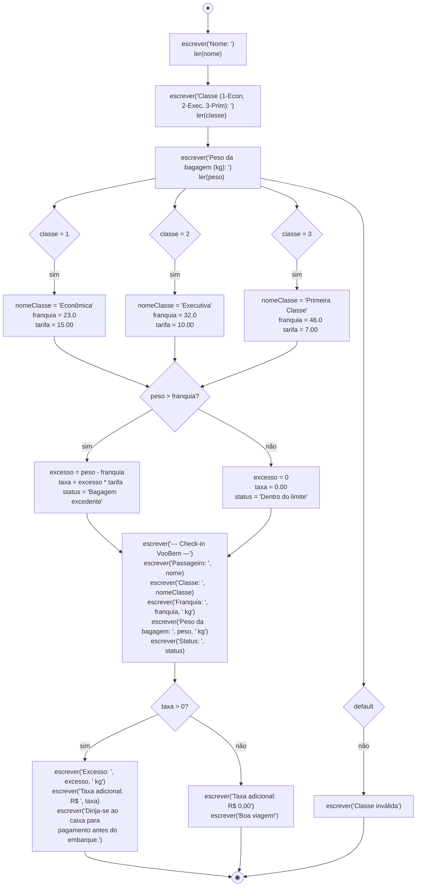

# Fluxograma — VooBem

```mermaid
flowchart TD
    A(("●")) --> B["escrever('Nome: ')
    ler(nome)"]

    B --> C["escrever('Classe (1-Econ, 2-Exec, 3-Prim): ')
    ler(classe)"]

    C --> D["escrever('Peso da bagagem (kg): ')
    ler(peso)"]

    D --> E1{"classe = 1"}
    D --> E2{"classe = 2"}
    D --> E3{"classe = 3"}
    D --> E4{"default"}

    E1 -->|sim| F1["nomeClasse = 'Econômica'
    franquia = 23.0
    tarifa = 15.00"]

    E2 -->|sim| F2["nomeClasse = 'Executiva'
    franquia = 32.0
    tarifa = 10.00"]

    E3 -->|sim| F3["nomeClasse = 'Primeira Classe'
    franquia = 46.0
    tarifa = 7.00"]

    E4 -->|não| F4["escrever('Classe inválida')"]

    F1 --> L{"peso > franquia?"}
    F2 --> L
    F3 --> L

    L -->|sim| M["excesso = peso - franquia
    taxa = excesso * tarifa
    status = 'Bagagem excedente'"]

    L -->|não| N["excesso = 0
    taxa = 0.00
    status = 'Dentro do limite'"]

    M --> O["escrever('--- Check-in VooBem ---')
    escrever('Passageiro: ', nome)
    escrever('Classe: ', nomeClasse)
    escrever('Franquia: ', franquia, ' kg')
    escrever('Peso da bagagem: ', peso, ' kg')
    escrever('Status: ', status)"]

    N --> O

    O --> P{"taxa > 0?"}

    P -->|sim| Q["escrever('Excesso: ', excesso, ' kg')
    escrever('Taxa adicional: R$ ', taxa)
    escrever('Dirija-se ao caixa para
    pagamento antes do embarque.')"]

    P -->|não| R["escrever('Taxa adicional: R$ 0,00')
    escrever('Boa viagem!')"]

    Q --> S(("◉"))
    R --> S
    F4 --> S
```
